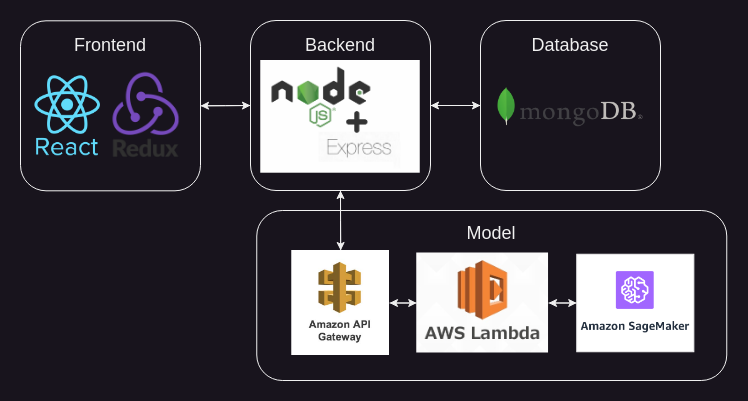

# SamGPT

 
[samgpt.dev](https://www.samgpt.dev)  
*Model runs from 9am-8pm EST, Mon-Fri in order to limit endpoint costs*

## Overview 
SamGPT is a custom built, locally trained, 10.5M parameter Decoder-Only Transformer (GPT) model integrated into a chatbot web application for real-time text predictions. The project demonstrates the feasibility of developing and deploying a lightweight GPT model for interactive applications.

## Software Development Process
### Planning
*During the planning phase, the following were established:*
- **Desired Functionalities**
    - User Authentication to protect from model overuse
        - Basic Sign Up and Login Functionality
            - Login Page
            - Register Page
        - Password encryption and storage
        - Session Management
    - Chat Interface
        - Simple and clean user interface for users to interact with model
        - Display user messages and model responses clearly
    - Graceful Error Handling for User Authentication and Chat Interactions
    - Conversation History

### Analysis

### Design

### Implementation 

### Testing & Integration

### Maintenance

## Model
### Development
### Training
### Hosting

## Web Application
### Technologies
### Hosting