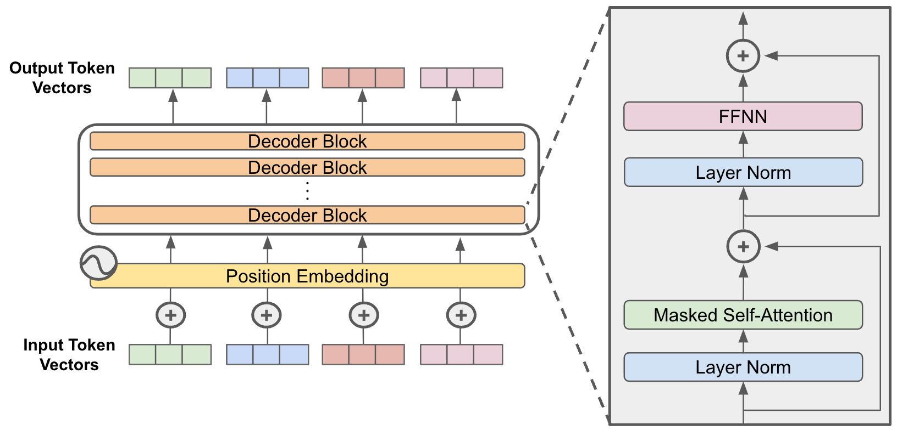

# SamGPT

<a href="https://www.samgpt.dev"></a><br/>
[SamGPT.dev](https://www.samgpt.dev)  
*Model usually runs from 9am-8pm EST, Mon-Fri in order to limit endpoint costs*

## Overview 
SamGPT is a custom built, locally trained, 10.5M parameter Decoder-Only Transformer (GPT) model integrated into a chatbot web application for real-time text predictions. The project demonstrates the feasibility of developing and deploying a lightweight GPT model for interactive applications.

## Software Development Process
### Planning
*During the planning phase, the following were established:*
- **Desired Functionalities**
    - User Authentication to protect from model overuse
        - Basic Sign Up and Login Functionality
            - Login Page
            - Register Page
        - Password encryption and storage
        - Session Management
    - Chat Interface
        - Simple and clean user interface for users to interact with model
        - Display user messages and model responses clearly
    - Graceful Error Handling for User Authentication and Chat Interactions
    - Conversation History

### Analysis
#### Feasibility:
- Hardware Limitations: A lightweight, less functional GPT model is required due to the model being trained on my PC rather than remotely.
- Compute Cost: There needs to be a balance between performance and compute, in order to limit costs, provide decent performance, and maintain reasonable response time.

#### Tech Stack:
The MERN (MongoDB, Express.js, React, Node.js) stack was chosen due to its efficiency in handling real-time applications, ease of development, and intuitive document based storage. MongoDB supports a document style conversation history storage, while React provides a dynamic and responsive UI.

#### Model Choice (Decoder Only Transformer):
The Decoder-Only Transformer model was chosen because it's specifically optimized for text generation tasks. Unlike standard Transformers or Encoder-Only models, the Decoder-Only architecture focuses solely on generating output based on previous context. This makes a simpler and more computationally efficient architecture. This model approach allows for relatively fast contextual interactions, which align with the kind of model I want a user to interact with.

### Design
#### Overall Architecture:
<br/>
#### UI Design Mockup:
<br/>


### Implementation 
#### Frontend:
- Developed with React for a responsive chat application interface.
- State management is handled using Redux to maintain chat history, user sessions, and UI states.
#### Backend:
- Built with Node.js and Express.js, responsible for handling API requests, user authentication, and managing sessions.
- Routes are divided into authentication (sign-up, login) and chat (handling messages and model predictions).
#### Database:
- MongoDB is used to store user information, session data, and conversation history.
- Schema definitions include user data (username, encrypted password), and chat logs (user messages, model responses, timestamps).

#### Frontend Implementation:
- #### UI Design:
    - CSS and third-party libraries (e.g., @chatscope/chat-ui-kit-react) were used for a clean, interactive design.
    - Responsive design was used for users on different devices.
- #### Chat Functionality:
    - Integrated real-time updates using React state hooks to manage message flow between user input and model responses.
    - Implemented form validation and error handling for a more intuitive user experience.

#### Backend Implementation:
- #### API:
    - Created RESTful API endpoints for authentication (/api/auth) and chat interactions (/api/chat).
    - Middleware was used for session validation and error handling.
- #### Model Integration:
    - Connected the backend to the GPT model endpoint on AWS SageMaker.
    - Developed an endpoint that securely sends user queries to the model and returns predictions, with rate limiting to prevent overuse.

## Model
<br/>  
The Decoder-Only Transformer model, used in SamGPT, is designed specifically for generative tasks like text generation and interactive chatbots. It consists solely of the decoder stack from the Transformer architecture, which processes input sequences and generates outputs token-by-token using self-attention to capture context from prior tokens. Compared to full Transformers or Encoder-Only models, the Decoder-Only Transformer is simpler and focuses directly on text generation rather than understanding or translating sequences. This makes it a great fit for chatbot applications that require dynamic and responsive conversation.  

### Hyper-Parameters:
- Parameter Count: ~10.5M
- Model Dimensionality (d_model): 256
- Head Count (num_heads): 4
- Number of Layers (num_layers): 2
- Dropout: 0.2
- Vocabulary Size: 30000
- Max Input Length (in tokens): 673
- Learning Rate: 1e-07
- Batch Size: 8 

### Training Data:
The model was training on the [SciQ Dataset](https://www.kaggle.com/datasets/thedevastator/sciq-a-dataset-for-science-question-answering) which contains 13,679 crowdsourced science exam questions covering subjects like Physics, Chemistry, and Biology. Each question is presented in a multiple-choice format with four answer options. For most questions, a supporting paragraph with evidence for the correct answer is included, providing rich contextual data for training the model. This context was used as a hint at the end of the input during training.

### Model Implementation:
The model was manually implemented from scratch using PyTorch, Python, and custom tokenizers built with the Hugging Face ```tokenizers``` library. Rather than leveraging pre-built Hugging Face GPT instances, the architecture and training loop were defined explicitly.

Tokenizers were trained specifically to the dataset rather than using a prebuilt vocabulary. This makes input sequences as efficient and applicable as possible to the dataset during encoding and decoding.

Cross-entropy loss was used as the primary loss function, optimized through the Adam optimizer with careful tuning of learning rates and batch sizes to prevent overfitting and ensure stable convergence.